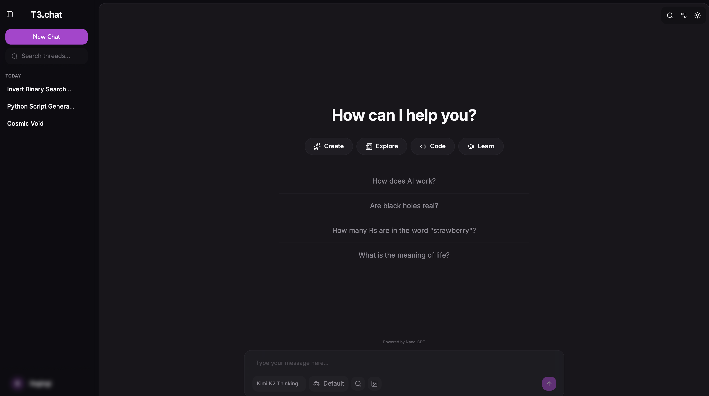

<div align="center">
  <h1>nanochat</h1>
  <p><em>Open-source, self-hostable chat client for <a href="https://nano-gpt.com">Nano-GPT</a>.</em></p>
  
</div>

## Contents

- [Native apps](#native-apps)
- [Quick start with Docker](#quick-start-with-docker)
- [Running with Bun](#running-with-bun)
- [Upgrading from the SQLite release](#upgrading-from-the-sqlite-release)
- [Reverse proxy](#reverse-proxy)
- [Features](#features)
- [URL parameters and shortcuts](#url-parameters-and-shortcuts)
- [Environment variables](#environment-variables)
- [Secrets at rest](#secrets-at-rest)
- [Tech stack](#tech-stack)
- [Contributing](#contributing)

## Native apps

| Platform | Project                                                                   | Notes                                                         |
| -------- | ------------------------------------------------------------------------- | ------------------------------------------------------------- |
| Android  | [nanochat-android](https://github.com/jcrabapple/nanochat-android)        |                                                               |
| iOS      | [nanochat-ios](https://github.com/nanogpt-community/nanochat-ios)         | [TestFlight beta](https://testflight.apple.com/join/afmPp2xW) |

## Quick start with Docker

Compose brings up its own Postgres and wires `DATABASE_URL` for the app, so there is nothing to provision. Data lives in `./data`.

```bash
git clone https://github.com/nanogpt-community/nanochat.git
cd nanochat
cp .env.example .env
# edit .env: set POSTGRES_PASSWORD and BETTER_AUTH_SECRET at minimum
docker compose up
```

The app is served on port 3432. Database migrations run automatically on every start.

## Running with Bun

You need [Bun](https://bun.sh/) and a Postgres 14+ database.

```bash
git clone https://github.com/nanogpt-community/nanochat.git
cd nanochat
cp .env.example .env
# edit .env: point DATABASE_URL at your database
bun install
bun run db:migrate
bun run dev
```

Run `bun run db:migrate` again after pulling updates that change the schema.

## Upgrading from the SQLite release

Older versions stored everything in `data/nanochat.db`. To move that data into Postgres:

1. Point `DATABASE_URL` at a new, empty Postgres database.
2. Run `bun run db:migrate` to create the schema.
3. Run `bun run db:migrate-from-sqlite`, passing a path if your database is not at `data/nanochat.db`.
4. Start the app, confirm your chats are there, then archive the old `.db` file.

On Docker, mount the old `data` directory into the container and run the same steps inside it:

```bash
docker compose exec app bun run db:migrate
docker compose exec app bun run db:migrate-from-sqlite /app/data/nanochat.db
```

The copy is idempotent (`on conflict do nothing`), so it is safe to re-run. Tables that did not exist in your old release are skipped. Uploaded files in `data/uploads` are untouched; keep that directory mounted.

## Reverse proxy

Streaming responses and file uploads need larger buffers than the nginx defaults. Add this to your server block:

```nginx
proxy_buffer_size 256k;
proxy_buffers 4 256k;
proxy_busy_buffers_size 256k;
client_max_body_size 50M;
```

## Features

nanochat started as a fork and has since replaced most of the stack: Convex became Postgres with Drizzle, Yarn became Bun, OpenRouter became Nano-GPT, and everything ships as a Docker image. Everything below is built on the Nano-GPT API.

### Chat

- **Web search** with a choice of provider: Linkup, Tavily, Exa, Kagi, Perplexity, Valyu, and Brave (standard, Pro, and Research). Standard and deep search modes, plus per-provider options such as Exa depth and Kagi source.
- **URL scraping**: paste a link and its content is added to the context.
- **YouTube transcripts**: video links are transcribed automatically at $0.01 per transcript. Thanks to [thejudge22](https://github.com/thejudge22).
- **Follow-up questions**: two or three contextual suggestions after each reply, generated by a background model and stored with the message. Click one to insert it. Toggle in settings.
- **Assistants**: named system prompts with a default model, web search mode, and search provider.
- **Projects**: group chats with shared instructions and attached files, with editor and viewer members.
- **Rules**: reusable instructions applied always or on demand with `@rule_name` in a message.
- **Provider selection**: for models served by several providers on Nano-GPT, pick one per model, set preferred and excluded providers, and fall back automatically.
- **MCP servers**: connect your own remote MCP servers and let the model call their tools.
- **Model benchmarks** from [Artificial Analysis](https://artificialanalysis.ai) in the model picker: intelligence, coding, math, and speed for LLMs, ELO and rank for image models. Requires `ARTIFICIAL_ANALYSIS_API_KEY`.
- **Analytics**: per-model usage, cost, and speed tracking, plus response ratings.
- **Themes**: configurable color themes inspired by T3 Chat.

### Memory

- **Persistent memory**: a background model extracts durable facts about you after each exchange and injects them into every chat. Memories are listed in settings where you can edit, add, or delete them.
- **Auto-compaction**: when a conversation nears the model's context limit, older messages are summarized so the chat can keep going. The threshold is adjustable, and any conversation can be compacted manually.

### Media

- **Image generation** in chat and in the Studio, with text-to-image and image-to-image. The Studio has a searchable model picker with vendor, mode, subscription, and price filters.
- **Video generation** in chat and in the Studio, with text-to-video and image-to-video. Finished clips are saved to My Stuff.
- **Text-to-speech**: OpenAI TTS-1 and HD, Kokoro, and ElevenLabs voices, with playback speed from 0.25x to 4x.
- **Speech-to-text**: Whisper Large V3, Wizper, and ElevenLabs via the microphone button.
- **My Stuff**: every generated or attached file in one place.

### Integrations and account

- **KaraKeep**: save conversations as bookmarks to your KaraKeep instance. Thanks to [jcrabapple](https://github.com/jcrabapple).
- **Passkeys** for sign-in (requires HTTPS) and optional OIDC single sign-on.
- **Developer API keys** for the HTTP API. See [api-docs.md](api-docs.md).
- **Scheduled tasks**: run a prompt on a cron, interval, or one-off schedule.

## URL parameters and shortcuts

Pre-configure a chat from the URL. Useful for bookmarks and browser "bang" shortcuts.

| Parameter                  | Description                                                           | Example                           |
| -------------------------- | --------------------------------------------------------------------- | --------------------------------- |
| `q`                        | Pre-fills the chat input                                              | `?q=Explain quantum physics`      |
| `model`                    | Selects the model                                                     | `?model=z-ai/glm-5.3`             |
| `model_provider`           | Selects the provider, or `auto` to clear                              | `?model_provider=cerebras`        |
| `search`                   | Web search mode: `off`, `standard`, `deep`                            | `?search=deep`                    |
| `search_provider`          | `linkup`, `tavily`, `exa`, `kagi`, `perplexity`, `valyu`, Brave modes | `?search_provider=brave-research` |
| `search_context_size`      | `low`, `medium`, `high`                                               | `?search_context_size=high`       |
| `search_exa_depth`         | `fast`, `auto`, `neural`, `deep`                                      | `?search_exa_depth=neural`        |
| `search_kagi_source`       | `web`, `news`, `search`                                               | `?search_kagi_source=news`        |
| `search_valyu_search_type` | `all`, `web`                                                          | `?search_valyu_search_type=web`   |
| `projectId`                | Opens the chat inside a project                                       | `?projectId=123`                  |

Example bang URL for a browser search engine:

```
https://nanochat.app/chat?model=z-ai/glm-5.3&search=deep&q=%s
```

## Environment variables

Copy `.env.example` and fill in what you need. Only the first group is required.

### Required

| Variable             | Description                                                                                        |
| -------------------- | -------------------------------------------------------------------------------------------------- |
| `DATABASE_URL`       | Postgres connection string. Set automatically by Docker Compose from `POSTGRES_PASSWORD`.          |
| `POSTGRES_PASSWORD`  | Password for the bundled Compose database                                                          |
| `BETTER_AUTH_SECRET` | Session encryption secret                                                                          |
| `BETTER_AUTH_URL`    | Public base URL, e.g. `https://chat.example.com`                                                   |
| `ENCRYPTION_KEY`     | Encrypts stored API keys and secrets. Generate with `openssl rand -base64 32` and never change it. |

### Nano-GPT

| Variable                                           | Description                                                                              |
| -------------------------------------------------- | ---------------------------------------------------------------------------------------- |
| `NANOGPT_API_KEY`                                  | Shared key used for users who have not added their own                                   |
| `NANOGPT_BASE_URL`                                 | Override the API base URL, for proxies                                                   |
| `SUBSCRIPTION_MODELS_ONLY`                         | Restrict shared-key users to subscription-included models                                |
| `DAILY_MESSAGE_LIMIT`                              | Daily quota for shared-key users across chat, media, and utility calls. `0` is unlimited |
| `DISABLE_WEB_ON_SERVER_KEY_WITH_SUBSCRIPTION_ONLY` | Also turn off web search and scraping for shared-key users                               |

### Optional

| Variable                                                                                                        | Description                                                                                            |
| --------------------------------------------------------------------------------------------------------------- | ------------------------------------------------------------------------------------------------------ |
| `DISABLE_SIGNUPS`                                                                                               | Set to `true` to stop new account creation                                                             |
| `BETTER_AUTH_TRUSTED_ORIGINS`                                                                                   | Comma-separated extra origins allowed to authenticate                                                  |
| `SSO_PROVIDER_ID`, `SSO_DOMAIN`, `SSO_OIDC_ISSUER`, `SSO_OIDC_CLIENT_ID`, `SSO_OIDC_CLIENT_SECRET`, `SSO_LABEL` | OIDC single sign-on button on the login page                                                           |
| `ARTIFICIAL_ANALYSIS_API_KEY`                                                                                   | Model benchmarks in the picker. Free key at artificialanalysis.ai                                      |
| `API_KEY_HASH_SECRET`                                                                                           | Dedicated secret for developer key lookup hashes. Defaults to `ENCRYPTION_KEY` or `BETTER_AUTH_SECRET` |
| `BODY_SIZE_LIMIT`                                                                                               | Request body limit in bytes for uploads. Default in the example is 50 MB                               |
| `USER_STORAGE_QUOTA_MB`                                                                                         | Per-user upload cap. Defaults to 2048 with open signups, unlimited when signups are disabled           |
| `MIN_FREE_DISK_MB`                                                                                              | Refuse uploads that would leave less than this free. Default 512                                       |
| `ALLOW_PRIVATE_INTEGRATIONS`                                                                                    | Let MCP servers and KaraKeep point at LAN addresses. Defaults to allowed when signups are disabled     |

## Secrets at rest

Provider keys, developer API keys, MCP tokens, and other stored secrets are encrypted with AES-256-GCM using `ENCRYPTION_KEY`. Developer API keys are also indexed by a keyed lookup hash, so authenticating a request never decrypts the key table.

- `ENCRYPTION_KEY` must be set before creating any stored secret.
- Upgrading from a release that stored keys in plaintext: run `bun run scripts/migrate-encrypt-api-keys.ts` once. Details in [`scripts/README-API-KEY-ENCRYPTION.md`](scripts/README-API-KEY-ENCRYPTION.md).
- Lookup hashes migrate themselves on startup.

## Tech stack

SvelteKit with Svelte 5, Tailwind CSS, Postgres with Drizzle ORM, Better Auth, Bun, and Docker. Nano-GPT is the only AI provider.

## Contributing

1. Fork the repository.
2. Create a feature branch.
3. Make your changes.
4. Open a pull request.

## License

MIT. See [LICENSE](LICENSE).
